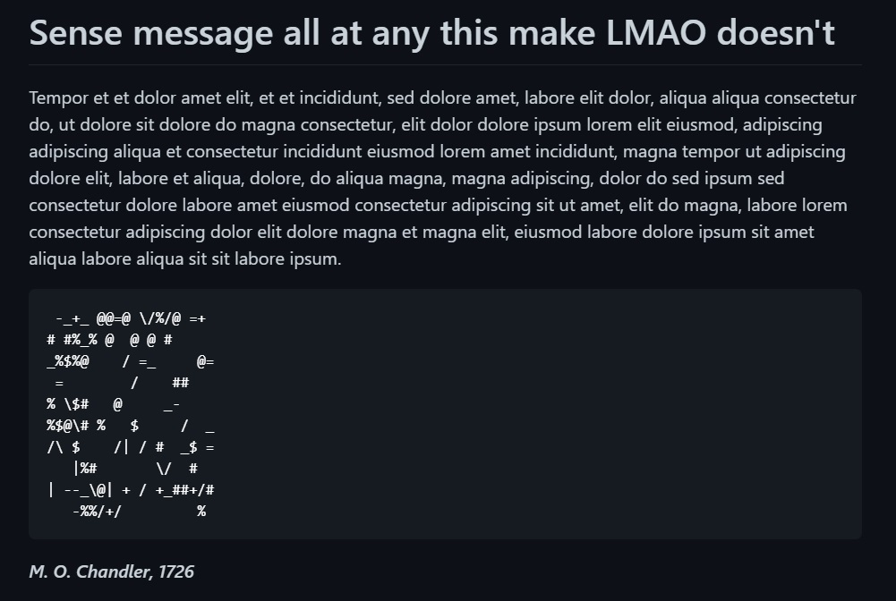

# Mixed Message v1.0.1

Main purpose of this project is to get used to development process involving VSCode, Command Line, Git, GitHub, Markdown, Node and basic JavaScript syntax.

Key parts of development process are:

- Setting up development environment and creating local repository

- Using Git and GitHub for version control and more structured development flow

- Designing a JS back-end app which creates randomly generated messages in Markdown format including header, paragraph, ASCII image and signature

- Further app tuning to provide prettier-looking outputs

Example of a message:

